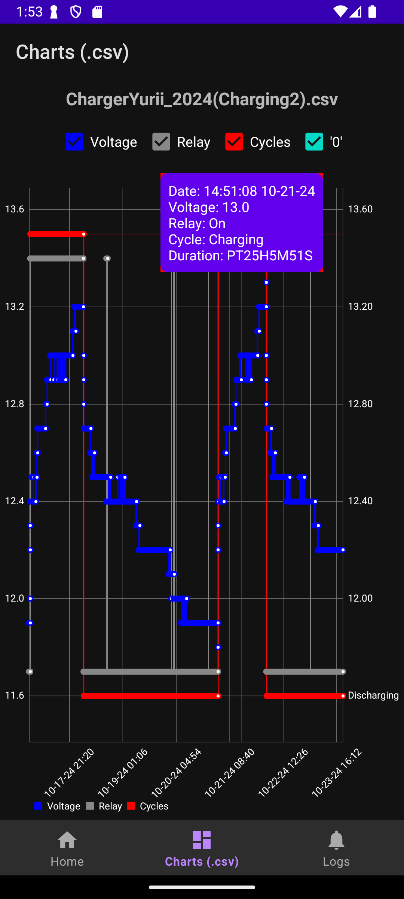
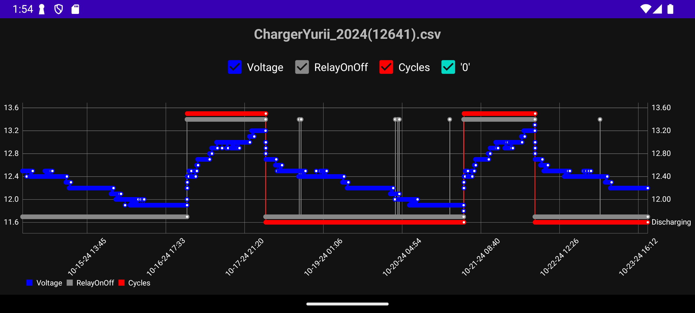
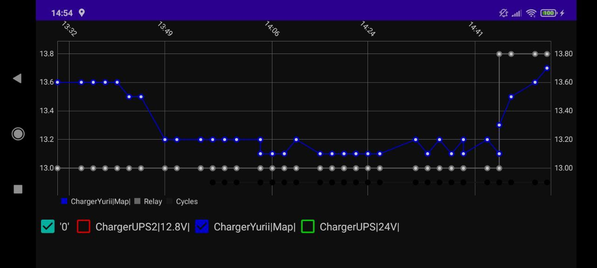
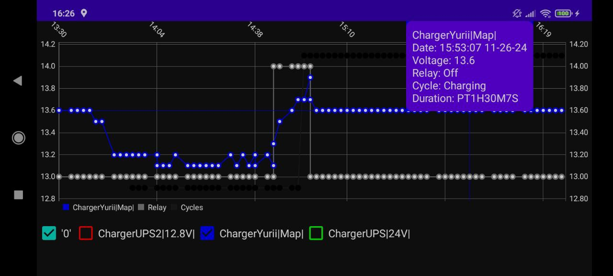
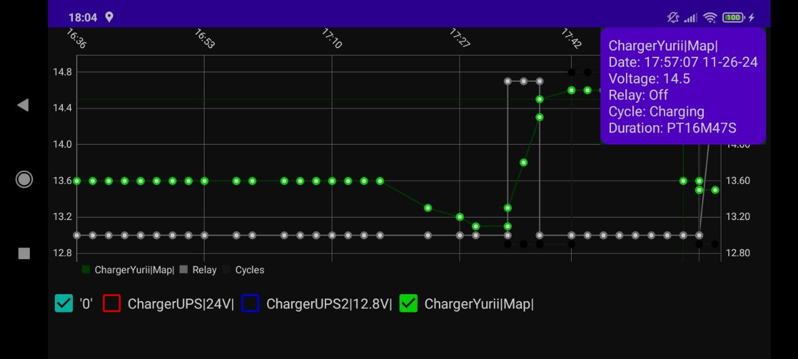

ChargerCharts2 - BMS (Battery Monitoring Service) & Health Tracker

Used with devices that described here:
```bash
   git clone  https://github.com/YBalan/Arduino/tree/master/Charger
```

ChargerCharts2 is a simple yet powerful Android app designed to track and visualize your device's charging patterns and battery health over time. This app provides real-time charging data, historical charts, and battery usage trends to help you maintain your device’s performance and prolong its lifespan.

Features:

Real-time charging statistics
Detailed battery health analysis
Beautiful, interactive charging charts
Battery usage history and trends
Customizable settings to suit your needs

Perfect for:

Users looking to monitor their device’s charging behavior
Optimizing battery life and health
Download now to keep track of your device’s charging habits and improve your battery health!





